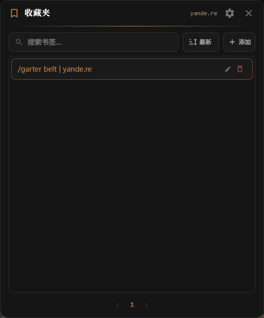

# Any Bookmark · 万能收藏夹

为每个网站提供独立的快速收藏夹功能，按照域名各自管理，适用于各种图站、论坛等。



起因：在 ~~yande.re~~ 上搜图的时候想存几个 tag 组合，发现这网站没有收藏功能。使用浏览器书签又太重，而且不好管理与打开，我要做的只是“在页面中管理页面相关的收藏”。

## 怎么装

1. 安装 [Tampermonkey](https://www.tampermonkey.net/)
2. 在[GitHub](https://github.com/Lu-Jiejie/any-bookmark/raw/gh-pages/any-bookmark.user.js)或GreasyFork安装此脚本。

## 基础用法

在拓展栏点击 TamperMonkey 图标，并选择该脚本，并点击 `在 XXX 显示收藏按钮` ，为该域名启用收藏功能。

点击右下角悬浮按钮打开面板。


点击添加以添加收藏。

收藏夹按域名分组。你在 `example.com` 收藏的内容，不会和 `github.com` 的混在一起。

## 正则提取

有些网站的页面标题很长，带着固定的前缀后缀。比如 `example.com` 某个标签页面的标题是 `Foo | Example.com`，你只想要前面的 `Foo`。

在添加栏里给当前域名设一个正则，比如 `^(.+?)\s*\|\s*Example.com$`，之后点"正则提取原标题"就会自动把页面标题 `Foo | Example.com` 提取为 `Foo`.

正则按域名保存。

## 多设备同步

支持通过 WebDAV 同步收藏数据。


自动同步：每 5 分钟自动检查远端更新，本地增删书签 3 秒内推送到远端。

## 开发

```bash
# 安装依赖
pnpm install
# 浏览器开发模式测试
pnpm dev
# 构建到 dist/
pnpm build
```

## Thanks

- [vite-plugin-monkey](https://github.com/lisonge/vite-plugin-monkey)

## License

[MIT](./LICENSE)
